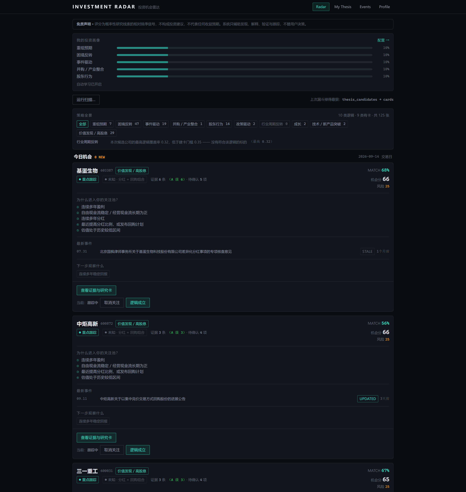
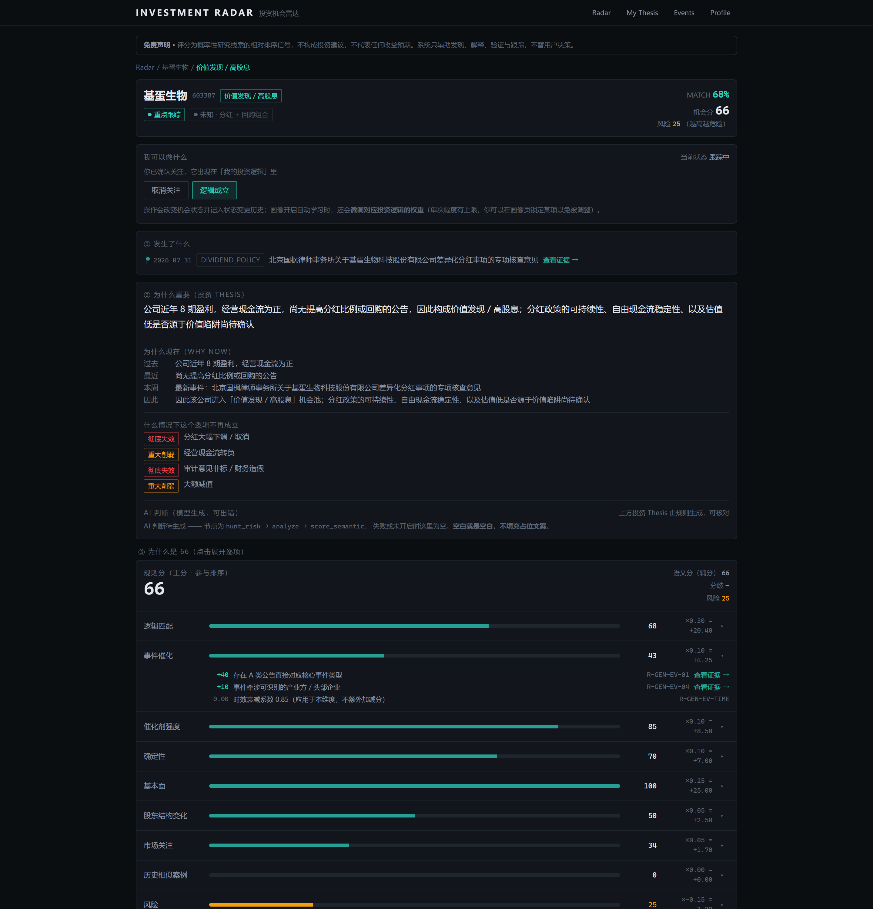
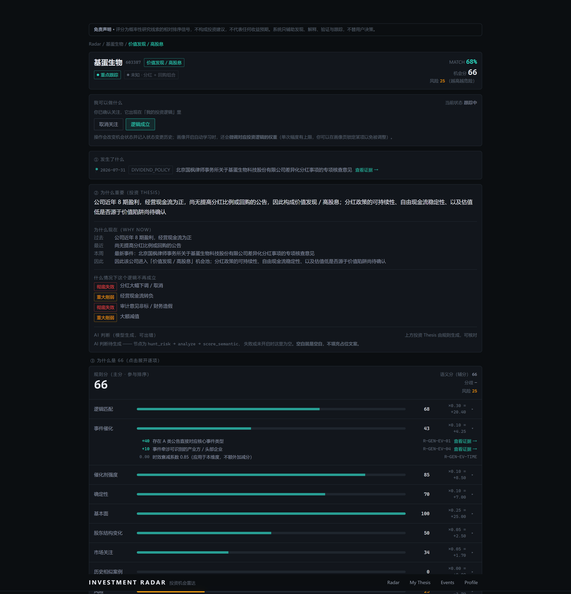
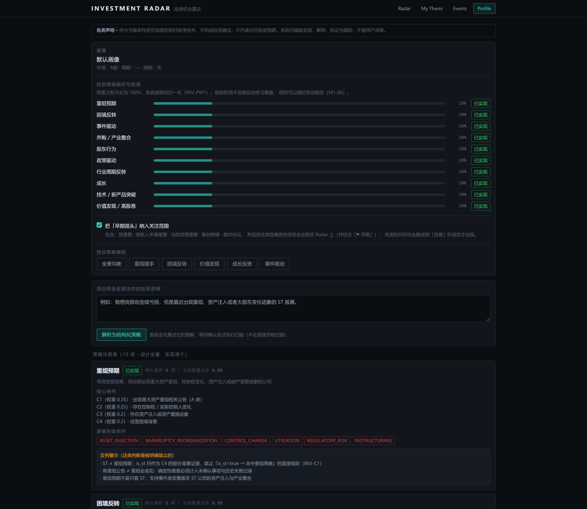

# Investment Opportunity Radar · 投资机会雷达

[](https://github.com/Wilson1030/Investment-Opportunity-Radar/actions/workflows/test.yml)
[](LICENSE)
[](https://www.python.org/)
[](#10-工程现状)
[](#9-定位与边界)

> 以**投资者画像**决定看什么、以**事件**为入口、以**投资逻辑（Thesis）**为组织方式、
> 以**证据链**为可信基础、以 **AI** 为研究辅助能力的**本地个性化投资机会发现系统**。



**它不回答「你该买哪只股票」，而回答「根据你的投资逻辑，市场上现在发生了哪些值得你关注的事、依据是什么、什么时候该放弃」。**

---

## 目录

- [1. 它解决什么问题](#1-它解决什么问题)
- [2. 六条核心理念](#2-六条核心理念)
- [3. 界面](#3-界面)
- [4. 十类投资逻辑](#4-十类投资逻辑)
- [5. 它怎么工作](#5-它怎么工作)
- [6. 数据源](#6-数据源)
- [7. 快速开始](#7-快速开始)
- [8. 常见问题（FAQ）](#8-常见问题faq)
- [9. 定位与边界](#9-定位与边界)
- [10. 工程现状](#10-工程现状)
- [11. 项目结构](#11-项目结构)
- [12. 开发原则](#12-开发原则)
- [许可与免责](#许可与免责)

---

## 1. 它解决什么问题

市面上主流的股票工具解决的是「**发生了什么价格变化**」和「**该买什么**」。
但对一类投资者来说，这两件事都不是最难的 —— 最难的是：

| 痛点 | 常见工具的应对 | 本项目的应对 |
|---|---|---|
| 消息太多，不知道哪条和我有关 | 信息流堆叠，靠你自己刷 | **按你的投资逻辑排序**，无关的不出现 |
| 看到一只票涨了，但不知道为什么涨 | 给结论、给"利好"标签 | 给出**投资 Thesis**：因为 X 逻辑，所以关注 Y |
| 想核实一下，找不到原文 | 转述、二手解读 | **证据链**：公告原文 + 可信度分级 + **跳到 PDF 对应页码** |
| 不知道这事有多确定 | 用肯定语气描述推测 | **三态待确认**：未确认 / 已确认 / **无法判定**（数据源没有的绝不假装能判） |
| 逻辑早就变了，却还挂在自选里 | 需要你自己想起来清理 | **每个逻辑都有失效条件**，系统主动发现并提醒 |
| 被 AI 结论绕进去，不知道能不能信 | 一个黑箱分数 | **规则分与 AI 判断分开呈现**，且规则分可逐项展开核对 |

一句话：**它是一个「研究线索的组织工具」，不是「答案的提供者」。**

---

## 2. 六条核心理念

这六条不是宣传语，是写进代码与测试的约束。

### ① 不输出确定性语言，不替用户决策

所有评分、匹配度、AI 判断都是**概率性研究线索**。代码层有**禁用词守卫**：
「必然上涨 / 稳赚 / 目标价 / 建议买入」这类词会被拦下并要求模型重写；
前端每一页都渲染免责声明，且**不允许被隐藏**。

### ② 每个判断必须可追溯到证据

- 公告全文落库 → 段落切分 → 证据带**可信度分级（A~E）**
- 证据带**页码锚点深链**：点进去直接跳到 PDF 的第 N 页第 M 段
- 评分可逐项展开到「哪条规则、加了多少分、引用哪条证据」
- 财务信号逐条对应到评分规则键

> **可解释的前提是可追溯。** 给一个无法核对的数字不算可解释。

### ③ 必须展示不确定性，必须主动找反证

- **待确认事项**分三态：`open`（还没消息）/ `confirmed`（依据已出现）/
  **`unverifiable`（当前数据源根本判不了，并说明原因）**
- 有一个专门的 AI 节点 `hunt_risk`，任务就是**找反证**——不是找利好
- 卡片上「反证」与「风险」与「支持证据」并列显示

### ④ 每个投资逻辑都必须有失效条件

没有失效条件的逻辑无法跟踪。所以：

- 每个策略在注册表里**必须**声明失效条件（空的话启动自检直接报错）
- 系统持续检查，命中就**自动迁移状态**并产生提醒
- 失效判定**不是单向门**：发现是误判可以纠正（含防抖动与强制留痕）

### ⑤ 确定性的事交给规则，需要语义理解的事交给 LLM

这条是硬边界（代码审查项）：

- ❌ LLM **不得**直接写分数、**不得**直接改状态
- ❌ 规则引擎**不得**做语义推断（比如用正则猜「重组会不会失败」）
- ✅ LLM 输出**必须**通过 JSON Schema 校验才能落库
- ✅ LLM 引用的证据 ID **必须**真实存在，否则丢弃并告警

### ⑥ 用户偏好必须可覆盖 AI 的学习结果

系统会从你的操作中学习（确认/忽略会微调对应逻辑的权重），但：

- 可**随时关闭**自动学习
- 可**锁定**某一项，锁定的永不被自动修改
- 每次调整都**告诉你改了什么、为什么**

---

## 3. 界面

### 雷达首页

左上是你自己的**投资画像**（10 类逻辑的权重，可直接调）。
「**策略全景**」把每一类逻辑的产出都交代清楚 —— 有几张卡、
**没卡的是为什么**（例如「行业周期反转」覆盖率 0.32，低于建卡门槛 0.35）。

每张机会卡包含：

| 元素 | 作用 |
|---|---|
| 阶段徽标 | 早期苗头会显式警示「低确定性」，避免把苗头当成确定的事 |
| 匹配度 / 机会分 / 风险分 | 三个不同含义的数字，不混为一谈 |
| 为什么进入你的关注池 | 命中了哪几条核心条件 |
| 最新事件 | 带时效标签（BREAKING / UPDATED / STALE） |
| 下一步观察什么 | 具体的、可等待的节点 |
| 操作按钮 | **随状态变化** —— 关注之后变成「取消关注」，随时可撤销 |

### 机会详情：严格的 7 步阅读顺序



```
① 发生了什么        事件时间线 + 相关报道聚类
② 为什么重要        投资 Thesis + Why Now + 失效条件 + AI 判断
③ 为什么与我有关     评分拆解 + 基本面数据（评分的事实依据）
④ 有什么证据        证据列表（含页码锚点深链）
⑤ 哪些地方还不确定   待确认事项（三态）
⑥ 风险是什么        风险 + 反证
⑦ 下一步看什么      观察清单
```

其中 ② 里并排放两样**性质完全不同**的东西，且明确标注来源：

| 内容 | 来源 | 能不能核对 |
|---|---|---|
| 投资 Thesis / Why Now / 失效条件 | **规则**（可追溯到条件与证据） | 能 |
| AI 判断 | **模型生成**（可能出错） | 需自行判断 |

不区分的话，读者无法判断该信哪句。

### 评分拆解与证据链



**为什么是 66 分**可以逐项展开到每个维度的每条规则（含权重、得分、规则编号）；
基本面（8 期 × 7 指标 + 9 条可溯源信号）是扣分 / 加分的事实依据；
证据带可信度与页码深链。

### 投资画像



6 套预设模板（默认「全景均衡」覆盖全部 10 类逻辑）+ 逐项调权重的滑块。
也可以用自然语言描述你的投资逻辑，系统解析成权重。

---

## 4. 十类投资逻辑

**十类全部已实现。** 每类都定义了核心条件（带权重）、失效条件、催化剂阶梯、
待确认模板与风险因素。

| # | 策略 | 用户在找什么 | 核心条件（权重） | 失效信号 |
|:-:|---|---|---|---|
| 1 | **重组预期** | 经营困难 + 出现重组 / 控制权 / 资产注入 / 破产重整迹象 | 重组类公告 A 类(0.35) · 控制权变化(0.25) · 资产注入(0.20) · 经营困境(0.20) | 重组终止 / 控股权变更取消 / 监管否决 |
| 2 | **困境反转** | 过去几个季度业绩差，**最近出现改善迹象**（经营周期拐点） | 经营恶化史(0.20) · **最近改善(0.30)** · 可归因举措(0.20) · 需求恢复(0.15) · **不依赖 ST 标签(0.15)** | 现金流转负 / 亏损扩大 / 毛利率重新恶化 |
| 3 | **事件驱动** | 有明确的**单一重大事件**在驱动 | 单一事件 A/B 类(0.35) · 金额规模(0.25) · 后续节点(0.20) · 方向明确(0.20) | 事件取消 / 终止 / 失败 / 规模下调 |
| 4 | **并购 / 产业整合** | 通过并购获得新业务，或行业集中度提升 | 并购事件(0.25) · 业务协同(0.20) · **交易质量可评估(0.25)** · 行业集中度(0.15) · 已进入合并体系(0.15) | 并购终止 / 业绩承诺未达标 / 商誉大额减值 |
| 5 | **股东行为** | 管理层或大股东**用真金白银**表达信心 | 增持/回购(0.30) · 规模显著(0.20) · 资金来源(0.20) · 现金流稳定(0.20) · 无质押风险(0.10) | 增持未实施 / 回购缩水 / 出现减持 |
| 6 | **政策驱动** | 政策重大变化后**直接受益**的公司 | 政策变化(0.20) · 行业识别(0.15) · 产业链拆到环节(0.20) · 主营高度相关(0.20) · **已有订单/收入验证(0.25)** | 细则缺失 / 政策被撤销 / 公司被排除 |
| 7 | **行业周期反转** | 行业经历长期下行后供需开始改善 | 长期下行(0.20) · 供给收缩(0.25) · 价格反弹(0.20) · 产能利用率(0.15) · 成本优势(0.20) | 价格重新下跌 / 库存累积 / 新增产能超预期 |
| 8 | **成长** | 收入与订单持续增长，且有扩张能力 | 行业需求(0.20) · **收入连续多季增长(0.20)** · 新订单(0.20) · 新产能/新品(0.20) · 份额提升(0.20) | 增速连续两季下滑 / 订单下滑 / 新品不及预期 |
| 9 | **技术 / 新产品突破** | 研发成果从实验室逐步走向商业化 | 研发投入(0.10) · 成果/认证(0.20) · 客户验证(0.20) · **商业订单(0.25)** · **收入贡献(0.25)** | 认证失败 / 客户流失 / 收入不及预期 / 技术被替代 |
| 10 | **价值发现 / 高股息** | 盈利稳定、现金流健康、持续分红、估值合理 | 连续盈利(0.15) · 现金流(0.20) · 连续分红(0.15) · **提高分红/回购(0.25)** · **估值分位(0.20)** · 低关注度(0.05) | 分红下调/取消 / 现金流转负 / 审计非标 / 大额减值 |

> **十类策略不是「筛选题材」，而是十种不同的问法。**
> 例如「困境反转」刻意**不依赖 ST 标签**（规格示例 J：
> *投资策略应该决定股票为什么被发现，而不是股票标签决定投资策略*）——
> 这条有源码级守卫：该策略的可执行代码里出现 `is_st` 会直接导致测试失败。

### 每类策略都有一条「验收闸门」

不是「实现了就算」，而是每类都有一个必须通过的具体检验（节选）：

| 策略 | 验收闸门 |
|---|---|
| 困境反转 | **策略与 ST 标签解耦** —— 只翻转 `is_st`，覆盖率必须完全不变 |
| 事件驱动 | **不依赖行情数据**也能产出机会（把行情与估值全部置空后仍达标） |
| 并购整合 | 交易质量必须**独立成条件**，否则退化成「公告数量排序」 |
| 股东行为 | **「计划」不等于「已实施」**（拟增持 ≠ 已增持） |
| 政策驱动 | Macro → Industry → Company 链路完整，**缺业务验证则压分** |
| 行业周期 | 行业数据缺失时**不给假分数**，明说「未采集」 |
| 成长 | **单季增长不等于成长**（需要连续多季 + 新订单 + 新产能） |
| 技术突破 | **认证 ≠ 订单**（五阶段分开计分，重心压在「能不能变成钱」） |
| 价值发现 | 估值分位**真判**（有数据源）+ 价值陷阱提示 |

---

## 5. 它怎么工作

### 分层架构

```
数据层     cninfo 公告 / 财务 / 估值 / 新闻 / 交易日历      （可插拔 Adapter）
   ↓
确定性层   ✦ Scope 候选池 → ✦ Classifier 事件分类 → ✦ Rules 规则命中
（Rule）     ✦ Scoring 评分 → ✦ Freshness 时效 → ✦ Guard 证据闸门与不变量
   ↓
语义层     ✦ extract_event 事件抽取  ✦ hunt_risk 找反证
（LLM）      ✦ analyze 研究叙事      ✦ score_semantic 语义补充分
             （节点是 JSON→JSON 纯函数；校验 / 重试 / 缓存 / 审计在节点之外）
   ↓
编排层     facts_builder → event_writer → opportunity_builder → analysis
   ↓
策略层     10 类策略（共享层承载机制，各策略只声明差异）
   ↓
服务层     FastAPI（23 个路径 / 25 个操作）→ React 前端（5 个页面）
```

### 候选池漏斗：不让 LLM 无差别分析所有股票

```
Stage 0  全市场公告元数据（约 1000~2000 条/日）
            │  scope 过滤（不下载全文）
Stage 1  候选池 ≈ 300 只（ST 名单 + 有重组类公告 + 控制权变更）
            │  仅对这些公司下载公告全文
Stage 2  规则初筛：关键词白名单 + 公告类型映射
            │  日增 30~80 条进入 LLM
Stage 3  LLM 事件抽取 → 结构化 Event（30~80 次调用/日）
Stage 4  策略归类 + 画像匹配（规则命中 + 权重计算）→ 候选机会 ≈ 20 个
Stage 5  LLM 深度分析：证据链 / 反证 / 不确定性 / 下一步观察
Stage 6  建卡（含门槛：逻辑强度 ≥ 0.35，与画像相关性 ≥ 30）
```

漏斗的每一级都被**如实计数**，首页会显示「掉得最狠的是哪一级」——
直接回答「今天为什么只有 N 张卡」。

### Rule 与 LLM 的分工（硬边界）

| 工作 | 归属 | 理由 |
|---|:-:|---|
| ST 名单判定、连续亏损年数、毛利率是否改善 | **Rule** | 可计算 |
| 公告类型关键词初筛 | **Rule** | 高效过滤，先砍掉 90% 无关公告 |
| 公告正文的语义理解与事件归类 | **LLM** | 同一标题可能对应完全不同的事件 |
| 投资逻辑推理、证据整理、反证搜索 | **LLM** | 规则无法穷举 |
| **评分计算** | **Rule（主分）** | 可复现、可审计、可调参 |
| **语义补充分** | **LLM（辅分）** | 只补规则盖不到的因素 |
| 排序、状态迁移判定、时效降权 | **Rule** | 必须确定性 |

### 评分：双分制

**八个维度**（权重合计 0.95，风险是扣分侧）：

| 维度 | 权重 | 看什么 |
|---|:-:|---|
| 逻辑匹配 | 0.30 | 命中了几条核心条件（加权满足度） |
| 事件催化 | 0.20 | 催化事件的类型、数量、金额规模 |
| 催化强度 | 0.10 | 处于哪个阶段（早期苗头 → 进展 → 完成） |
| 确定性 | 0.10 | 证据等级、待确认事项数量、历史失败记录 |
| 基本面 | 0.10 | 连续亏损年数、现金流、毛利率趋势、负债 |
| 股东结构 | 0.10 | 增持/回购/质押/减持 |
| 市场关注 | 0.05 | 新闻聚类数、异常波动 |
| 历史案例 | 0.00 | 同类事件的历史表现（数据积累后启用） |

**两个分数各看一个角度：**

- **规则分**（主分，参与排序）——可复现、可逐项核对
- **语义分**（辅分）——LLM 只补规则没覆盖的隐性因素

**分歧本身就是研究信号**：分歧大于阈值时系统会提醒你人工复核
（可能是规则漏了因素，也可能是模型在编造）。

### 证据链

```
公告 PDF/HTML → 全文落库 → 段落切分（记录页码 + 段序）
    → LLM 引用具体段落 → ★ 证据闸门校验（段落真实存在？文本真的对得上？）
    → 通过才落库为 Evidence（带可信度 A~E）→ 深链带页码锚点
```

证据闸门会拒绝：不存在的段落、文本对不上的引用、可信度过低的断言。
**没有证据的判断不写进系统。**

### 状态机：机会的完整生命周期

```
已发现 → 待确认 → 跟踪中 → 逻辑成立 → 观察中
           ↓         ↓         ↓          ↓
        逻辑失效 ←────┴─────────┴──────────┘
           ↓
        已归档 ←── 也允许回到「待确认 / 跟踪」（「暂时忽略」必须真的暂时）
```

状态迁移**只能**走合法边（不合法会报错并告诉你哪些合法），
每次变更写入状态日志（含原因与分数前后对比）。

---

## 6. 数据源

**全部实测可达**（不可达的源直接不用，不硬接）：

| 数据源 | 内容 | 实测延迟 |
|---|---|---|
| **巨潮资讯 cninfo** | 公告列表 + 全文（PDF/HTML） | 0.5s |
| **同花顺** | 结构化财务摘要（7 指标 × 报告期） | 0.5s |
| **新浪财经** | 现金流量表（经营现金流总额）+ 全市场行情 + 日线 | 0.4s / 34s / 0.7s |
| **百度股市通** | 估值序列（市值 / PE / PB + 近三年历史分位） | 0.2s |
| **财联社电报 + 新浪** | 财经新闻（用于去重与聚类） | 0.2s |
| **新浪** | 交易日历（8797 个交易日） | — |

> ⚠️ **东方财富的接口在作者所在网络不可达**，因此本项目没有依赖它。
> 若你的网络下某个源不通，采集会**记录错误并继续**，不会中断整批。

---

## 7. 快速开始

**前置要求**：Python 3.13 · Node.js 18+ · 可选 [Ollama](https://ollama.com/download)

### 1. 环境

```bash
conda create -n radar python=3.13 -y     # 或用 venv
conda activate radar
pip install -e "backend/.[ingest]"       # 含采集层；不采集可省 .[ingest]
cd frontend && npm install && cd ..
```

### 2. 配置

```bash
cp .env.example .env      # 不改也能跑：默认走本机 Ollama
ollama pull qwen3:4b      # 若用本机模型
ollama serve
```

想换云端模型（DeepSeek / 智谱 / Kimi / OpenAI / Claude …共 13 家）：
**只改 provider 名 + 填 key**，端点已内置。全表与成本参考见
**[docs/08-模型接入指南.md](docs/08-模型接入指南.md)**。

### 3. 初始化数据库

```bash
python tools/reset_db.py --yes --seed    # --seed 造一组离线样例，便于立刻看到界面
```

### 4. 启动（一条命令）

```bash
python tools/start_all.py                # 后端 + 前端一起起，Ctrl+C 一起停
```

打开 **http://127.0.0.1:5173** 即可。启动前会自动检查解释器依赖 / 端口占用 /
前端依赖 / 数据库文件，并给出**可执行的**修复提示，而不是让你对着报错猜。

### 5. 灌入真实数据

点首页的「**运行扫描…**」（可指定检索词与回看天数，建议先不勾「真写库」看一遍会命中什么），
或用命令行：

```bash
cd backend
python -m app.ingest --source cninfo --pool market --searchkey 重整 \
    --lookback-days 120 --market-pages 30 --limit 12 --llm-limit 12 --live
```

> 全部已采集的事实可以**不重新采集**而直接重算机会：
> `python -m app.ingest --source cninfo --stage rescore --live`（纯规则，约 2 秒）

---

## 8. 常见问题（FAQ）

**Q：装依赖时报 `No module named 'app'`**
在 `backend/` 目录下运行后端命令，或先在仓库根目录 `pip install -e "backend/"`。

**Q：不想装 akshare / pandas 这么大的依赖**
采集层是可选依赖：`pip install -e "backend/"` 只装核心（能跑测试与界面），
真去抓数据时才需要 `.[ingest]`。

**Q：首页一张机会卡都没有**
按顺序检查：① 跑过采集吗 ② 是 dry-run 吗（dry-run **只出报告不写库**，
要加 `--live`）③ 看首页的「漏斗提示」，它会指出掉得最狠的一级。

**Q：某类策略一直没有卡，是没实现吗？**
不是。「策略全景」会给出**可核对的原因**：覆盖率差多少、或画像未关注。
最常见的两种：**画像未关注**（权重 0，永远不会出卡）/
**候选池里没有符合该类逻辑的标的**（只有重整类公告时，成长、产品类自然无卡）。

**Q：`reset_db` 报「radar.db 被占用」**
Windows 上服务占着文件就删不掉：
```bash
python tools/reset_db.py --yes --stop    # 先停服务再重置
```

**Q：本地模型跑得特别慢，或输出是空的**
两个已知原因：① **思考型模型（qwen3）的推理 token 也计入输出上限**，
不关思考会把上限吃光、正文一个 token 都轮不到（默认已关）；
② 输出上限不能设太小（设 900 时正常 JSON 会被截断，默认 2500）。
详见 [docs/08](docs/08-模型接入指南.md) 的「三个已知的坑」。

**Q：某些数据源连不上**
本项目只用实测可达的源。若某个源不通，采集会记录错误并继续，不中断整批。

**Q：端口被占用**
启动脚本会先检测并给出结束占用进程的命令；手动查：`netstat -ano | findstr :8000`。

**Q：前端显示「离线演示数据」**
后端没起或接口不通时，前端会**自动降级**到内置样例并明确标注 ——
你仍能看到界面结构，但数据是假的。启动后端即恢复。

**Q：跑测试需要什么？**
什么都不需要（不联网、不需要模型）：
```bash
cd backend && pip install -e ".[dev]" && python -m pytest       # 636 个用例，约 15 秒
cd frontend && npm ci && npm run render:check                    # 真实渲染自检
```

---

## 9. 定位与边界

### 它**不是**什么

- ❌ **不是选股器 / 荐股工具** —— 不给目标价、不说"可以买"
- ❌ **不是行情软件** —— K 线与技术指标属于**辅助信息层**，首屏不出现
- ❌ **不做择时** —— 不判断买卖时点
- ❌ **不是短线工具** —— 事件驱动 + 基本面逻辑，持有周期以月计

### 它做不到什么（诚实说明）

| 缺什么 | 状态 |
|---|---|
| 实时行情、K 线、技术指标 | **未接入**（新浪行情源实测可用，但产品定位上属于辅助层） |
| 持仓管理（成本 / 盈亏 / 仓位） | **未做** |
| 按股票代码/名称搜索 | **未做** —— 入口是**事件**，不是股票 |
| 打新 / 可转债 / ETF | **未做** |
| 行业供需数据 | **未接入** → 「行业周期反转」策略基本无法工作 |
| 回测 | **未做** |
| 研报数据 | **未接入** |

### 它适合谁

有自己的投资逻辑（基本面 / 事件驱动）、持有周期以月计、
想要**早期苗头**而不是热点、**宁愿自己核对原文也不信"据说"**、
关心"我这个逻辑什么时候算错了"的投资者。

如果你想要的是「今天买什么」，这个工具会让你失望 —— 这是设计如此，不是缺陷。

---

## 10. 工程现状

| 维度 | 状态 |
|---|---|
| 设计文档 | 10 份 / 5500+ 行（`docs/00` ~ `docs/09`） |
| 后端 | 110 个模块 · **636 个测试全通过**（约 15 秒，不联网、不需要模型） |
| 前端 | 27 个文件（16 组件 / 5 页面）· 类型检查 + **真实渲染自检** + 生产构建全通过 |
| 策略 | **10 / 10 已实现**，每类都有对应的验收闸门测试 |
| 数据库 | 24 张业务表 · 6 个 Alembic 迁移 |
| AI 节点 | 5 个（抽取 / 归类 / 找反证 / 叙事 / 语义分），全 provider 可换 |
| CI | GitHub Actions：后端测试 + 前端三步检查 |

### 已验证的能力（跑通过的真实数字，不是计划）

```
真实数据链路   255 条公告 → 6 事件 → 18 组策略命中 → 6 张卡，39 秒
LLM           抽取 12/12 · 反证 6/6 · 叙事 6/6 · 语义分 6/6
              单条约 7 秒（关闭思考模式后快 11 倍）
策略覆盖       125 张卡覆盖 9 类策略（行业周期反转需行业数据，暂缺）
PDF 解析       失败率 0.00（真实重整公告，最长 441 段落）
证据闸门       15/15 通过；证据归属跨公司错位 0 条
页码锚点       声明的页 = 片段实际所在页（5/5 抽样核对）
财务采集       10/10 家 × 120 期；估值 4/4 家（含近三年 PE/PB 分位）
```

### 质量保障方式

除了常规单元测试，这个项目有一套针对**它自己踩过的坑**的守卫：

- **渲染自检**（`npm run render:check`）——真的把组件渲染成 HTML 再断言内容。
  因为 `tsc` 通过只说明类型对、`build` 通过只说明能打包，
  **都不能证明数据被渲染出来了**
- **源码级守卫** —— 例如「策略代码里不得读 `is_st`」「文案里不得出现 Markdown 强调符」
  （后者会导致前端原样显示星号）
- **不变量测试** —— 12 条领域不变量（证据必须可追溯、失效条件不得为空、
  状态迁移必须合法…）
- **cross-strategy 一致性测试** —— 新增策略时自动被纳入检查

---

## 11. 项目结构

```
Investment_Opportunity_Radar/
├── backend/
│   ├── app/
│   │   ├── engine/          确定性层：候选池 / 分类 / 规则 / 评分 / 时效 / 守卫
│   │   │   └── anomaly.py   财务异常识别与归因（INV-F1）
│   │   ├── ai/              语义层
│   │   │   ├── provider.py  13 个 provider 预设（只填 key 即可换）
│   │   │   ├── runner.py    执行器：校验 / 重试 / 缓存 / 审计
│   │   │   ├── nodes/       5 个纯函数节点
│   │   │   └── prompts/     版本化 prompt
│   │   ├── strategies/      策略层
│   │   │   ├── common/      ★ 10 类策略共用的判定机制
│   │   │   ├── restructuring/ · turnaround/ · value/ · growth/ …（各 10 类）
│   │   │   └── registry.py  十类策略的完整设计元数据
│   │   ├── pipeline/        编排层：事实构建 / 事件落库 / 机会组装 / AI 分析
│   │   ├── ingest/          采集层：cninfo / 财务 / 估值 / 新闻 / 交易日历
│   │   ├── models/          24 张表 + 枚举 + 不变量
│   │   ├── api/             23 个路径 / 25 个操作
│   │   └── scheduler/       交易日感知的三段式调度
│   ├── tests/               636 个用例（30 个测试文件）
│   └── alembic/             6 个迁移
├── frontend/
│   └── src/
│       ├── pages/           Radar / Opportunity / MyThesis / Events / Profile
│       ├── components/      16 个组件
│       └── scripts/         ★ render_check.mjs 真实渲染自检
├── docs/                    10 份设计文档 + 4 张截图
│   ├── 00-决策记录.md        13 项冻结决策
│   ├── 01-产品规格拆解.md
│   ├── 02-领域模型与数据模型.md
│   ├── 03-系统架构与AI工作流.md
│   ├── 04-评分与证据链.md
│   ├── 05-API契约.md
│   ├── 06-策略设计总表.md     ★ 10 类策略的完整设计
│   ├── 07-MVP实施计划.md      实施记录（含所有踩过的坑）
│   ├── 08-模型接入指南.md     ★ 换模型看这个
│   └── 09-项目状态与交接.md    维护者内部交接文档
└── tools/                   一键启动 / 重置库 / 抽样核对 / 缓存迁移 等 8 个脚本
```

---

## 12. 开发原则

源自产品规格第 60 节，**改代码前必须遵守**：

1. 不要理解成传统股票行情软件；K 线、技术指标属于**辅助信息层**。
2. 优先围绕「事件 → Thesis → Opportunity → Evidence」设计。
3. 所有机会必须结合**用户投资倾向**；同一个市场，不同用户看到不同的雷达。
4. 所有重要 AI 判断尽可能提供**证据链**，并区分事实 / 推断 / 假设 / 市场讨论。
5. 必须展示不确定性，必须主动寻找**反证**。
6. 每个 Thesis 都必须有**失效条件**；「待确认」必须写明**具体待确认事项**。
7. 评分不可设计成不可解释的黑盒。
8. **确定性的事情交给规则与程序；需要语义理解的事情交给 LLM。**
9. 不要让 LLM 无差别分析所有股票 —— 先建候选池。
10. 新闻需去重、聚类、事件化；财报需结构化并提炼潜在投资逻辑。
11. 首页强调「今日机会」与「为什么现在」，而不是信息堆叠。
12. 用户行为可以形成 Feedback Loop，但**必须允许用户覆盖 AI 学习结果**。

> 完整的实施记录（包括所有踩过的坑、误判与修复过程）见
> [`docs/07-MVP实施计划.md`](docs/07-MVP实施计划.md) 与
> [`docs/09-项目状态与交接.md`](docs/09-项目状态与交接.md)。

---

## 许可与免责

[MIT](LICENSE) —— 可自由使用、修改、商用，保留版权声明即可。

**免责**：本项目是**投资研究与信息组织工具**，不是荐股工具，不构成任何投资建议。
所有评分、匹配度、AI 判断均为概率性研究线索，**不承诺收益**。
据此进行的任何投资决策及其后果由使用者自行承担。
