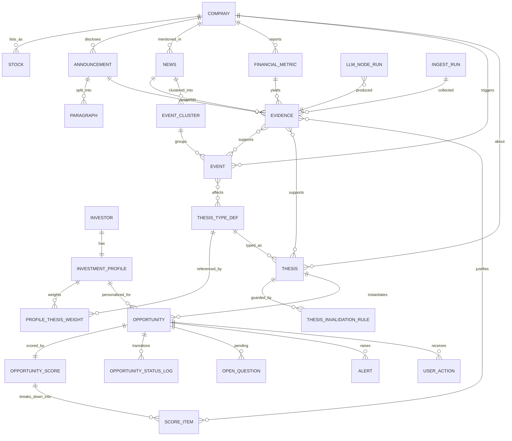
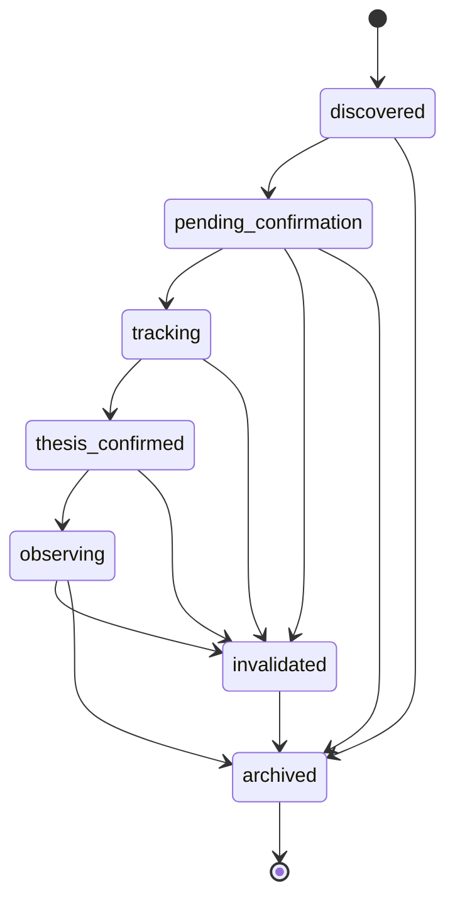

# 02 · 领域模型与数据模型

> 本文件定义系统的全部实体、字段、枚举、关系与不变量。
> 实现位置：`backend/app/models/`（SQLModel）。迁移工具：Alembic。

---

## 1. 建模原则

| # | 原则 | 出处 |
|:---:|---|---|
| 1 | **Company 与 Stock 必须分开** —— 投资逻辑发生在 Company / Event，而不是 Price | §30 |
| 2 | **核心对象不是 Stock**，而是 `Investor · InvestmentProfile · Company · Event · Evidence · Thesis · Opportunity` | §2 |
| 3 | **Opportunity = Company × Profile × Thesis**，不是单纯的股票对象 | §5.7 |
| 4 | **Evidence 是一等公民**，必须能定位到原文段落 | §15 |
| 5 | **评分必须可逐项拆解**，每一项绑定证据或规则 | §13 |
| 6 | **事件发生时间 ≠ 系统发现时间**，两者不可混用 | §40 |
| 7 | 每个 Thesis 必须有失效条件 | §58 原则 5 |
| 8 | 表结构预留 `user_id`，但 MVP 不实现鉴权 | D02 |
| 9 | 所有 LLM 调用可审计（model + prompt_version + 输入哈希） | M11-06 |
| 10 | 节点为纯函数，持久化由外层负责 | D06 |

---

## 2. 实体关系总览



---

## 3. 枚举定义

### 3.1 EventType（§10，16 类 + OTHER）

```
M&A                        并购
RESTRUCTURING              重大资产重组
ASSET_INJECTION            资产注入
CONTROL_CHANGE             控制权 / 实际控制人变更
SHAREHOLDER_BUY            股东增持
SHAREHOLDER_SELL           股东减持
BUYBACK                    公司回购
BANKRUPTCY_REORGANIZATION  破产重整
EARNINGS_TURNAROUND        业绩拐点 / 业绩预告
POLICY_CATALYST            政策催化
MAJOR_CONTRACT             重大合同 / 订单
NEW_PRODUCT                新产品 / 技术突破
MANAGEMENT_CHANGE          管理层变化
REGULATORY_RISK            监管风险（问询函 / 监管函 / 风险提示）
LITIGATION                 重大诉讼
DIVIDEND_POLICY            分红政策变化   ← 规格 §5.6 示例 C 需要
OTHER                      其他
```

> 说明：规格 §7.2 的公告类型清单（含定增、股权激励、停复牌、年报/半年报等）先映射到以上 16 类；
> 「停牌/复牌」建模为 Event 的**属性**（影响可交易性）而非独立类型。

### 3.2 ThesisType（§5.6 的 10 类）

```
restructuring        重组预期
turnaround           困境反转
value                价值发现 / 高股息
growth               成长投资
event_driven         事件驱动
policy               政策驱动
cycle                行业周期反转
product              技术 / 新产品突破
shareholder_action   股东行为（增持 / 回购）
ma_integration       并购 / 产业整合
```

### 3.3 OpportunityStatus（§20）



| 状态 | 含义 | 进入条件 |
|---|---|---|
| `discovered` | 系统第一次发现机会 | 候选池通过策略规则 |
| `pending_confirmation` | 存在逻辑，但重要信息未确认 | `open_questions` 非空 |
| `tracking` | 证据进一步增加，值得持续关注 | 用户确认关注，或证据数超阈值 |
| `thesis_confirmed` | 核心 Thesis 获得较强证据支持 | 存在 A 类证据直接支撑核心命题 |
| `observing` | 用户进一步观察 | 用户手动 |
| `invalidated` | 出现直接破坏原逻辑的事件 | 命中 `ThesisInvalidationRule` |
| `archived` | 归档 | 用户手动或长期无更新 |

### 3.4 其他枚举

```python
class ReliabilityLevel(StrEnum):     # §16
    A = "A"   # 公司正式公告 / 交易所披露
    B = "B"   # 公司财报 / 官方文件
    C = "C"   # 高可信媒体
    D = "D"   # 机构 / 研究观点
    E = "E"   # 社交媒体 / 市场讨论

class AssertionKind(StrEnum):       # §60-6：区分事实/推断/假设/讨论
    FACT = "fact"
    INFERENCE = "inference"
    HYPOTHESIS = "hypothesis"
    MARKET_DISCUSSION = "market_discussion"

class FreshnessTag(StrEnum):        # §41
    NEW = "new"; UPDATED = "updated"; BREAKING = "breaking"; STALE = "stale"

class SourceType(StrEnum):
    ANNOUNCEMENT = "announcement"; FINANCIAL_REPORT = "financial_report"
    NEWS = "news"; POLICY = "policy"; PRICE = "price"; OTHER = "other"

class CertaintyLevel(StrEnum):      # §10 certainty
    DISCLOSED = "disclosed"                  # 已官方披露
    PARTIALLY_DISCLOSED = "partially_disclosed"
    MEDIA_REPORTED = "media_reported"
    MARKET_RUMOR = "market_rumor"

class ScoreSource(StrEnum):
    RULE = "rule"; LLM = "llm"

class ScoreDimension(StrEnum):      # §12 / §14
    EVENT_CATALYST = "event_catalyst"            # 事件催化
    THESIS_MATCH = "thesis_match"                # 逻辑匹配
    CERTAINTY = "certainty"                      # 确定性
    MARKET_ATTENTION = "market_attention"        # 市场关注
    FUNDAMENTALS = "fundamentals"                # 基本面
    SHAREHOLDER_STRUCTURE = "shareholder_structure"  # 股东结构变化
    HISTORY_CASE = "history_case"                # 历史类似事件
    RISK = "risk"                                # 风险（负向）

class StrategyStatus(StrEnum):
    IMPLEMENTED = "implemented"; DESIGNED = "designed"; PLANNED = "planned"

class NodeRunStatus(StrEnum):
    OK = "ok"; SCHEMA_ERROR = "schema_error"; LLM_ERROR = "llm_error"; CACHED = "cached"
```

---

## 4. 实体定义

### 4.1 Investor / InvestmentProfile（§4 / §29）

```python
class Investor(SQLModel, table=True):
    id: int | None = Field(default=None, primary_key=True)
    handle: str = Field(unique=True, index=True)   # MVP 固定 "owner"
    display_name: str
    created_at: datetime

class InvestmentProfile(SQLModel, table=True):
    id: int | None = Field(default=None, primary_key=True)
    investor_id: int = Field(foreign_key="investor.id", index=True)
    name: str
    # M1-05
    horizon: str | None          # 投资周期：short / mid / long
    markets: list[str]           # ["A股"]  ← JSON 列
    industry_prefs: list[str]
    exclusions: list[str]        # 排除条件
    risk_tolerance: str | None   # 次要字段，不作为主要分类依据（§4.1）
    # M1-06 反馈闭环
    auto_learn_enabled: bool = Field(default=True)
    locked_weights: list[str]    # 被用户锁定的 thesis_type，自动学习不得覆盖
    created_at: datetime
    updated_at: datetime
```

**不变量**
- INV-P1：`locked_weights` 中的 thesis_type，自动学习权重不得变更（M1-06）。
- INV-P2：不提供「保守/稳健/激进」三档控件（§4.1）。

### 4.2 ProfileThesisWeight（§4.3）

```python
class ProfileThesisWeight(SQLModel, table=True):
    id: int | None = Field(default=None, primary_key=True)
    profile_id: int = Field(foreign_key="investmentprofile.id", index=True)
    thesis_type: ThesisType
    weight: float                # 0~1，不必和为 1（读取时归一化）
    source: str                  # manual / template:<name> / learned
    updated_at: datetime
```

**不变量**：INV-PW1 —— 读取时归一化，写入时不强制和为 1。

### 4.3 ThesisTypeDef（策略注册表，§5 / D13）

```python
class ThesisTypeDef(SQLModel, table=True):
    code: ThesisType = Field(primary_key=True)
    display_name: str            # 重组预期
    status: StrategyStatus       # implemented / designed
    description: str
    # 设计全量、实现逐个：以下字段在 designed 阶段即已填好（docs/06）
    rule_spec: dict              # 规则条件定义（供 Rule Engine 读取）
    thesis_template: str         # Thesis 语句模板
    support_event_types: list[EventType]
    invalidating_event_types: list[EventType]
    open_question_templates: list[str]
    default_weights: dict[str, float]   # ScoreDimension → 权重
    evidence_requirements: dict  # 最低证据要求，如 {"A": 1}
    sort_order: int
```

**不变量**
- INV-TT1：`invalidating_event_types` 不得为空（§58 原则 5）。
- INV-TT2：`status=implemented` 的策略必须存在对应的规则实现类。

### 4.4 Company / Stock（§30）

```python
class Company(SQLModel, table=True):
    id: int | None = Field(default=None, primary_key=True)
    name: str = Field(index=True)
    full_name: str | None
    unified_social_credit_code: str | None = Field(default=None, index=True)
    industry: str | None
    industry_chain: list[str]        # 产业链标签（示例 E 需要）
    province: str | None
    # 关系字段（§48 轻量知识图谱的起步形态）
    controlling_shareholder: str | None
    actual_controller: str | None
    is_st: bool = Field(default=False, index=True)
    is_risk_warning: bool = Field(default=False, index=True)
    listed_at: date | None
    delisted_at: date | None
    created_at: datetime
    updated_at: datetime

class Stock(SQLModel, table=True):
    id: int | None = Field(default=None, primary_key=True)
    company_id: int = Field(foreign_key="company.id", index=True)
    code: str = Field(unique=True, index=True)   # 600xxx / 000xxx / 8xxxxx
    exchange: str                                # SSE / SZSE / BSE
    board: str | None                            # 主板 / 创业板 / 科创板 / 北交所
    name: str
    is_active: bool = True
```

**不变量**：INV-C1 —— `is_st` 是**筛选条件**，不是投资逻辑（§5.6 示例 J：困境反转不应依赖 ST 标签）。

### 4.5 Announcement / News（§7 / §42）

```python
class Announcement(SQLModel, table=True):
    id: int | None = Field(default=None, primary_key=True)
    company_id: int = Field(foreign_key="company.id", index=True)
    document_id: str = Field(index=True)          # cninfo 唯一 ID，用于幂等去重
    title: str
    announcement_type: str | None                 # 原始类型（§7.2 清单）
    event_type: EventType | None                  # 归类后的标准类型（LLM 填）
    publication_time: datetime = Field(index=True)
    discovery_time: datetime                      # 系统发现时间（§40）
    source_url: str
    # 全文（D10）
    raw_path: str | None                          # data/raw/... 本地文件
    raw_format: str | None                        # pdf / html
    fulltext: str | None
    parse_status: ParseStatus                     # ok / partial / failed / needs_ocr
    parse_error: str | None
    paragraph_count: int = 0
    ingest_run_id: int | None = Field(default=None, foreign_key="ingestrun.id")
    __table_args__ = (UniqueConstraint("company_id", "document_id"),)   # INV-NF-04 幂等

class Paragraph(SQLModel, table=True):
    """段落切分：Evidence 定位到原文的最小单位（D10）"""
    id: int | None = Field(default=None, primary_key=True)
    announcement_id: int = Field(foreign_key="announcement.id", index=True)
    page: int
    para_index: int
    text: str
    char_start: int
    char_end: int
    __table_args__ = (UniqueConstraint("announcement_id", "page", "para_index"),)

class News(SQLModel, table=True):
    id: int | None = Field(default=None, primary_key=True)
    external_id: str = Field(index=True)
    title: str
    summary: str | None
    source_name: str
    source_reliability: ReliabilityLevel          # C / D / E
    publication_time: datetime = Field(index=True)
    discovery_time: datetime
    url: str
    related_company_ids: list[int]
    related_industries: list[str]
    event_type: EventType | None
    sentiment: str | None                         # positive / negative / neutral
    cluster_id: int | None = Field(default=None, foreign_key="eventcluster.id")
    __table_args__ = (UniqueConstraint("source_name", "external_id"),)
```

### 4.6 FinancialMetric / FinancialPeriod（§8）

```python
class FinancialPeriod(SQLModel, table=True):
    id: int | None = Field(default=None, primary_key=True)
    company_id: int = Field(foreign_key="company.id", index=True)
    period: str                     # 2026H1 / 2026Q3 / 2025A
    period_end: date
    report_type: str                # annual / semi / q1 / q3 / express / forecast
    published_at: datetime | None
    source_url: str | None
    __table_args__ = (UniqueConstraint("company_id", "period", "report_type"),)

class FinancialMetric(SQLModel, table=True):
    """结构化指标 + 同比 + 异常标记（M2-03 / M2-11）"""
    id: int | None = Field(default=None, primary_key=True)
    period_id: int = Field(foreign_key="financialperiod.id", index=True)
    metric: str = Field(index=True)  # revenue / net_profit / ocf / receivable / gross_margin / debt_ratio
    value: float | None
    unit: str | None
    yoy: float | None                # 同比
    qoq: float | None
    is_anomaly: bool = False
    anomaly_note: str | None         # 「净利润下降」的可能原因（一次性费用/减值/周期…）
```

**不变量**：INV-F1 —— 单指标恶化**不得**直接判定为利空（§8）。异常必须走 `anomaly_note` 归因。

### 4.7 Evidence（§15 / §16 / §32）★核心

```python
class Evidence(SQLModel, table=True):
    id: int | None = Field(default=None, primary_key=True)
    # 来源
    source_type: SourceType
    source_name: str                   # 巨潮资讯 / 东方财富 / 公司公告
    source_url: str
    publication_time: datetime = Field(index=True)
    reliability_level: ReliabilityLevel = Field(index=True)
    # 溯源（D10：段落级）
    announcement_id: int | None = Field(default=None, foreign_key="announcement.id", index=True)
    paragraph_id: int | None = Field(default=None, foreign_key="paragraph.id")
    document_id: str | None
    relevant_text: str                 # 原文段落摘录（不得改写）
    page: int | None
    para_index: int | None
    # 语义
    assertion_kind: AssertionKind = AssertionKind.FACT
    extracted_facts: list[str]         # 结构化事实
    confidence: float                  # 0~1，对「抽取本身正确」的信心
    produced_by_node_run_id: int | None = Field(default=None, foreign_key="llmnoderun.id")
    created_at: datetime
```

**不变量**
- INV-E1：`relevant_text` 必须是原文片段，禁止 LLM 改写（改写会导致无法核对）。
- INV-E2：`reliability_level ∈ {C,D,E}` 的证据，不得单独支撑 `thesis_confirmed` 状态（M4-04）。
- INV-E3：`source_type=announcement` 时 `announcement_id` 不得为空。

### 4.8 Event / EventCluster（§10 / §31 / §42）

```python
class Event(SQLModel, table=True):
    id: int | None = Field(default=None, primary_key=True)
    company_id: int = Field(foreign_key="company.id", index=True)
    event_type: EventType = Field(index=True)
    title: str
    summary: str
    # 时间（§40 严格区分）
    event_time: datetime = Field(index=True)        # 事件实际发生时间
    discovery_time: datetime = Field(index=True)    # 系统发现时间
    # 双维评分（M3-04）
    importance: float            # 0~1
    certainty: float             # 0~1
    certainty_level: CertaintyLevel
    # 来源
    source_type: SourceType
    source_url: str
    # 关联
    affected_thesis: list[ThesisType]
    evidence_ids: list[int]
    cluster_id: int | None = Field(default=None, foreign_key="eventcluster.id")
    # 属性（如停牌影响可交易性）
    attributes: dict
    is_invalidating: bool = False     # 是否命中某 Thesis 的失效规则
    created_at: datetime

class EventCluster(SQLModel, table=True):
    """新闻聚类结果（§42/§43）"""
    id: int | None = Field(default=None, primary_key=True)
    company_id: int | None = Field(default=None, foreign_key="company.id")
    label: str                    # "围绕 ST XXX 重组事件的 17 条报道"
    event_type: EventType | None
    member_count: int
    key_points: list[str]         # 提炼出的 3~5 条要点
    first_seen: datetime
    last_seen: datetime
```

**不变量**
- INV-EV1：`event_time <= discovery_time`；采集层必须校验。
- INV-EV2：同一 `(company_id, event_type, event_time, source_url)` 不得重复入库。

### 4.9 Thesis（§21 / §23）

```python
class Thesis(SQLModel, table=True):
    id: int | None = Field(default=None, primary_key=True)
    company_id: int = Field(foreign_key="company.id", index=True)
    thesis_type: ThesisType = Field(index=True)
    statement: str                # 「公司处于 ST 状态，同时出现重大资产重组及控制权变化，因此存在潜在重组预期。」
    # Why Now（M5-04 固定字段）
    why_now_past: str | None
    why_now_recent: str | None
    why_now_this_week: str | None
    why_now_conclusion: str
    # 证据
    supporting_evidence_ids: list[int]
    contradictory_evidence_ids: list[int]      # 反证（M5-06）
    # 失效
    invalidating_event_types: list[EventType]
    # 未确认
    open_question_ids: list[int]
    # 状态
    is_active: bool = True
    created_at: datetime
    updated_at: datetime

class ThesisInvalidationRule(SQLModel, table=True):
    id: int | None = Field(default=None, primary_key=True)
    thesis_type: ThesisType = Field(index=True)
    event_type: EventType
    match_condition: dict          # 如 {"title_contains": ["终止", "失败"]}
    severity: str                  # terminal / severe / warning
    description: str
    __table_args__ = (UniqueConstraint("thesis_type", "event_type", "severity"),)
```

### 4.10 Opportunity（§33）★核心

```python
class Opportunity(SQLModel, table=True):
    id: int | None = Field(default=None, primary_key=True)
    # 三元组（§5.7）
    company_id: int = Field(foreign_key="company.id", index=True)
    profile_id: int = Field(foreign_key="investmentprofile.id", index=True)
    thesis_id: int = Field(foreign_key="thesis.id", index=True)
    user_id: int | None = Field(default=None, foreign_key="investor.id", index=True)   # D02 预留
    # 状态
    status: OpportunityStatus = Field(default=OpportunityStatus.DISCOVERED, index=True)
    # 分数（D08 双分）
    rule_score: float | None
    semantic_score: float | None
    divergence: float | None
    risk_score: float | None
    # 叙事字段（§25 / M5-04/05）
    summary: str | None
    why_now: list[str]
    supporting_evidence_ids: list[int]
    uncertainties: list[str]
    risks: list[str]
    next_events_to_watch: list[str]
    contradictory_evidence_ids: list[int]
    # 时间（§40）
    first_discovered_at: datetime = Field(index=True)
    last_updated_at: datetime
    score_version: str                     # 规则集版本，便于重算对比
    __table_args__ = (UniqueConstraint("company_id", "profile_id", "thesis_id"),)

class OpportunityScore(SQLModel, table=True):
    id: int | None = Field(default=None, primary_key=True)
    opportunity_id: int = Field(foreign_key="opportunity.id", index=True)
    dimension: ScoreDimension
    raw_value: float               # 0~100
    weight: float
    weighted_value: float
    source: ScoreSource            # rule / llm
    computed_at: datetime
    __table_args__ = (UniqueConstraint("opportunity_id", "dimension", "source"),)

class ScoreItem(SQLModel, table=True):
    """可点击拆解的每一项加减分（M6-03 / §13）"""
    id: int | None = Field(default=None, primary_key=True)
    opportunity_id: int = Field(foreign_key="opportunity.id", index=True)
    source: ScoreSource
    dimension: ScoreDimension
    delta: float                   # +25 / -10
    reason: str                    # 「存在重大资产重组公告」
    rule_id: str | None            # 命中的规则 ID（可追溯到规则源码）
    evidence_ids: list[int]        # 绑定的证据（可追溯到原文段落）
    created_at: datetime

class OpenQuestion(SQLModel, table=True):
    """「待确认」必须具体（M7-02 / §24）"""
    id: int | None = Field(default=None, primary_key=True)
    opportunity_id: int = Field(foreign_key="opportunity.id", index=True)
    question: str                  # 「交易标的」「交易价格」「重组方案」「监管审核结果」
    status: str                    # open / confirmed / obsolete
    confirmed_evidence_id: int | None = Field(default=None, foreign_key="evidence.id")
    resolved_at: datetime | None

class OpportunityStatusLog(SQLModel, table=True):
    id: int | None = Field(default=None, primary_key=True)
    opportunity_id: int = Field(foreign_key="opportunity.id", index=True)
    from_status: OpportunityStatus | None
    to_status: OpportunityStatus
    reason: str
    triggered_by_event_id: int | None = Field(default=None, foreign_key="event.id")
    score_before: float | None
    score_after: float | None
    changed_at: datetime

class Alert(SQLModel, table=True):
    """Thesis 监控提醒（M7-04 / §22）"""
    id: int | None = Field(default=None, primary_key=True)
    opportunity_id: int = Field(foreign_key="opportunity.id", index=True)
    alert_type: str                # thesis_invalidated / thesis_strengthened / new_evidence
    title: str                     # 「投资逻辑发生重大变化」
    message: str
    score_before: float | None
    score_after: float | None
    triggered_by_event_id: int | None = Field(default=None, foreign_key="event.id")
    is_read: bool = False
    created_at: datetime = Field(index=True)

class UserAction(SQLModel, table=True):
    """反馈闭环（§35/§36）"""
    id: int | None = Field(default=None, primary_key=True)
    investor_id: int = Field(foreign_key="investor.id", index=True)
    opportunity_id: int = Field(foreign_key="opportunity.id", index=True)
    action: str                    # viewed / confirmed / ignored / tracked
    reason_thesis_types: list[ThesisType]   # 「你关注它的核心逻辑是什么？」
    created_at: datetime
```

### 4.11 采集与 AI 审计（M2-13 / M11-06 / M11-07 / M12-07）

```python
class IngestRun(SQLModel, table=True):
    id: int | None = Field(default=None, primary_key=True)
    adapter: str                   # cninfo / akshare
    scope: str                     # st_and_risk_warning / all_a_shares
    dry_run: bool
    started_at: datetime
    finished_at: datetime | None
    items_found: int = 0
    items_new: int = 0
    items_skipped: int = 0
    items_failed: int = 0
    parse_failed: int = 0
    parse_needs_ocr: int = 0
    parse_failure_rate: float | None       # R2 可观测指标
    field_missing_rate: float | None
    error_summary: str | None

class LlmNodeRun(SQLModel, table=True):
    """节点纯函数的外部审计记录（D06 / M11-06）"""
    id: int | None = Field(default=None, primary_key=True)
    node_name: str = Field(index=True)      # extract_event / classify_thesis / hunt_risk / analyze
    input_hash: str = Field(index=True)     # 缓存键（M11-07）
    prompt_version: str = Field(index=True)
    provider: str
    model: str = Field(index=True)
    status: NodeRunStatus
    attempt: int = 1
    prompt_tokens: int | None
    completion_tokens: int | None
    latency_ms: int | None
    output_json: dict | None
    error: str | None
    created_at: datetime = Field(index=True)
    __table_args__ = (UniqueConstraint("node_name", "input_hash", "prompt_version"),)
```

### 4.12 Watchlist

规格未将自选股作为核心，但保留最小可用形态，**且必须以 Thesis 为组织方式**（M5-01）：

```python
class WatchlistItem(SQLModel, table=True):
    id: int | None = Field(default=None, primary_key=True)
    profile_id: int = Field(foreign_key="investmentprofile.id", index=True)
    opportunity_id: int = Field(foreign_key="opportunity.id", index=True)
    note: str | None
    added_at: datetime
```

**不变量**：INV-W1 —— 不允许只存 `company_id`；关注对象必须是 Opportunity（即绑定 Thesis）。

---

## 5. 关键不变量汇总（供测试直接使用）

| ID | 不变量 | 验证方式 |
|---|---|---|
| INV-P1 | 锁定权重不被自动学习覆盖 | 单测：`apply_learned_weights()` 后断言 |
| INV-TT1 | 每个 ThesisTypeDef 有非空失效条件 | 启动自检 + 单测遍历 10 类 |
| INV-TT2 | implemented 策略有对应实现类 | 启动自检 |
| INV-C1 | 规则中不得出现「is_st → 困境反转」的直接映射 | 规则审查 |
| INV-E1 | Evidence.relevant_text 能在原文中找到 | 单测：子串匹配全文 |
| INV-E2 | C/D/E 类证据不得单独确认 Thesis | 单测状态迁移 |
| INV-E3 | 公告类证据必有 announcement_id | DB 约束 + 单测 |
| INV-EV1 | event_time ≤ discovery_time | DB 约束 + 单测 |
| INV-EV2 | 事件幂等去重 | 重复采集单测 |
| INV-F1 | 单指标恶化不直接判利空 | 规则审查 + 单测 |
| INV-W1 | 关注对象必须是 Opportunity | DB 外键 |
| INV-NF-04 | 采集幂等 | 同一批数据跑两次，行数不变 |

---

## 6. 索引与性能

MVP 规模（~300 只股票 / 每日 30~80 条公告）下 SQLite 完全够用。预先建好以下索引以支撑列表页：

```
opportunity   (status, rule_score DESC)          # Radar 首页
opportunity   (profile_id, last_updated_at DESC) # Feed 排序
opportunity   (company_id)                       # 公司维度聚合
event         (company_id, event_time DESC)      # 事件时间线
event         (discovery_time DESC)              # 最近重要事件
evidence      (reliability_level, publication_time DESC)
announcement  (publication_time DESC, parse_status)
llm_node_run  (node_name, input_hash, prompt_version)  # 缓存命中（唯一索引）
```

**迁移到 Postgres 的触发条件**（D04 复议）：单表 > 500 万行，或需要并发写入（多进程采集）。

---

## 7. SQLModel / Alembic 实施约定

1. `list[...]` / `dict` 字段用 `sa_column=Column(JSON)`；Postgres 下改 `JSONB`。
2. 枚举统一用 `StrEnum` + `sa_column=Column(SAEnum(...))`，存字符串而非整数，便于直接读数据库排查。
3. 所有时间字段用 timezone-aware UTC 存储，展示层转 `Asia/Shanghai`。
4. `data/radar.db` 由 Alembic 管理；禁止手改表结构。
5. 表名前缀统一无前缀小写（`opportunity`、`score_item`），中间表用 `xxx_yyy`。
