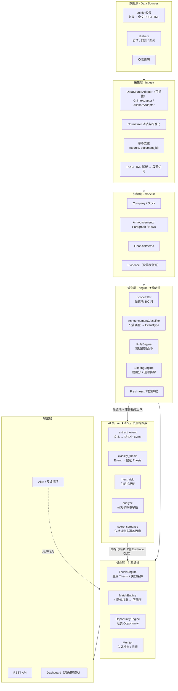
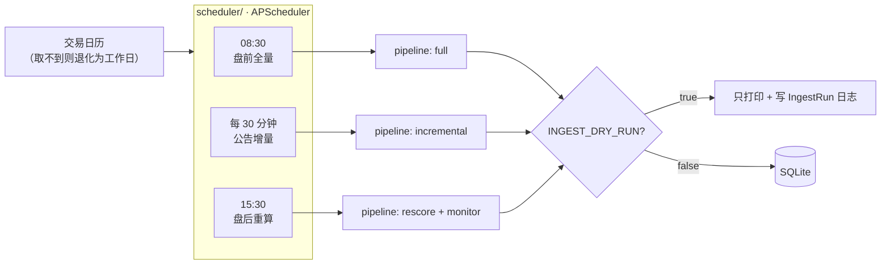

# 03 · 系统架构与 AI 工作流

> 定义分层架构、Rule Engine 与 LLM 的职责边界、候选池漏斗、节点契约、缓存与降级策略。

---

## 1. 分层架构（对应 §47）



---

## 2. Rule Engine 与 LLM 的职责分离（§28）★

> **原则：确定性的事情尽量交给规则和程序；需要理解语义的事情交给 LLM。**

### 2.1 归属对照表

| 工作 | 归属 | 理由 |
|---|:---:|---|
| ST/*ST 名单判定 | **Rule** | 显式条件、可从数据直接得出 |
| 连续亏损年数、毛利率连续改善、现金流是否转正 | **Rule** | 可计算 |
| 公告类型 → EventType 的**关键词白名单初筛** | **Rule** | 高效过滤，先砍掉 90% 无关公告 |
| 公告正文的实际语义理解与事件归类 | **LLM** | 同一标题可能对应完全不同的事件 |
| 事件重要程度 / 确定性 | 两者协作 | Rule 给基线（来源级别、是否官方披露），LLM 在基线内调整 |
| 候选池筛选、阈值、标签 | **Rule** | 数据筛选与一致性 |
| 投资逻辑推理（这条事件支持哪个 Thesis） | **LLM** | 需要语义推理 |
| 证据整理、不确定性识别 | **LLM** | 需要语义 |
| 反证搜索 | **LLM** | 规则无法穷举反证 |
| **评分计算** | **Rule**（主分） | 可复现、可审计、可调参（§13） |
| **语义补充分** | **LLM**（辅分） | 只补规则盖不到的因素 |
| 评分解释的措辞 | **LLM** | 自然语言表达 |
| 排序 | **Rule** | 确定性 |
| 状态迁移判定 | **Rule** 触发 + LLM 建议 | 失效规则是显式定义的 |
| 时效降权 | **Rule** | 时间算术 |
| 新闻去重与聚类 | Rule（相似度）+ LLM（要点提炼） | 各司其职 |

### 2.2 硬性边界（代码审查项）

- ❌ LLM **不得**直接写 `rule_score`。
- ❌ LLM **不得**直接改 `Opportunity.status`，只能产出 `Event.is_invalidating` 供规则判定。
- ❌ Rule Engine **不得**做语义推断（如用正则去猜「重组是否会失败」）。
- ✅ LLM 的输出**必须**通过 JSON Schema 校验后才能落库。
- ✅ LLM 引用的 Evidence ID **必须**已存在，否则丢弃并告警（见 §6.3 证据闸门）。

---

## 3. 候选池漏斗（§27）

> 不要让 LLM 无差别分析所有股票。

```
Stage 0  数据源全量元数据
         全 A 股公告列表（约 1000~2000 条/日）
              │  scope 过滤（不下载全文）
              ▼
Stage 1  候选池 Company  ≈ 300 只                          【Rule: ScopeFilter】
         ├ ST / *ST 全量名单                      ~180
         ├ 近 90 天有重组类公告                    ~150
         └ 近 90 天控制权/实控人变更                ~80
              │  仅对这些公司下载公告全文
              ▼
Stage 2  规则初筛：关键词白名单 + 公告类型映射
         日增进入 LLM 的公告  30~80 条                      【Rule: AnnouncementClassifier】
              │
              ▼
Stage 3  LLM 事件抽取 → 结构化 Event   30~80 次调用/日      【LLM: extract_event】
         产出事件 约 40~70 条
              │
              ▼
Stage 4  Thesis 归类 + 画像匹配（规则命中 + 权重计算）        【Rule + LLM: classify_thesis】
         候选机会  ≈ 20 个
              │
              ▼
Stage 5  LLM 深度分析：证据链 / 反证 / 不确定性 / Next Watch 【LLM: hunt_risk + analyze】
              │
              ▼
Stage 6  评分（规则主分 + 语义辅分）→ 排序                    【Rule + LLM: score_semantic】
              │
              ▼
         展示  5~10 张机会卡
```

**日志要求**：每级漏斗计数写入 `IngestRun` / pipeline 运行日志，可回答「为什么今天只有 3 张卡」。
**成本含义**：LLM 调用总量 = `30~80`（抽取）+ `5~10`（深度分析）≈ 每日 ≤90 次，且抽取层结果被缓存（重复文档不重跑）。

---

## 4. 节点契约（D06：JSON → JSON 纯函数）★

### 4.1 通用约定

```python
# backend/app/ai/nodes/base.py
class Node(Protocol):
    name: str                 # 唯一标识，用于缓存与审计
    prompt_version: str       # 语义变更时递增 → 缓存自动失效
    input_schema: type[BaseModel]
    output_schema: type[BaseModel]

    def __call__(self, payload: InputT) -> OutputT: ...
```

**硬性约束（保证可迁移到 LangGraph）**
- 节点内 **不得** 访问 DB、文件系统、网络（LLM 调用通过注入的 `LLMProvider` 完成）。
- 节点 **不得** 读取全局可变状态。
- 节点 **不得** 修改输入对象。
- 相同 `(input, prompt_version, model)` → 相同输出（在 temperature=0 前提下）。
- 所有输出必须通过 `output_schema` 校验，否则视为失败。

### 4.2 `extract_event`

```yaml
输入:
  company:   {name, code, is_st, industry}
  announcement: {document_id, title, announcement_type, publication_time}
  paragraphs: [{page, para_index, text}]     # 已切分的全文段落
输出:
  event_type: EventType
  title: str
  summary: str
  event_time: datetime | null                # 未披露则 null，不得猜测
  importance: float                          # 0~1
  certainty: float                           # 0~1
  certainty_level: CertaintyLevel
  affected_thesis: [ThesisType]
  extracted_facts: [str]
  evidence_slices:                           # 关键：LLM 必须指出原文出处
    - {page: int, para_index: int, relevant_text: str}   # relevant_text 必须是原文片段
  not_mentioned: [str]                        # 明确「公告中未提及」的信息（防补全）
```

**防幻觉机制**：`evidence_slices[].relevant_text` 回来后必须与 `Paragraph.text` 做子串校验，
不匹配 → 该条 slice 作废并计入告警（见 §6.3）。

### 4.3 `classify_thesis`

```yaml
输入:
  event: {event_type, summary, extracted_facts, certainty_level}
  company_facts: {is_st, loss_years, industry, controlling_shareholder, ...}
  candidate_thesis_defs: [ThesisTypeDef]        # 由 Rule Engine 预筛，不让 LLM 看全部 10 类
输出:
  candidates:
    - thesis_type: ThesisType
      rationale: str                            # 为什么这条事件支持该逻辑
      hit_evidence_slices: [int]                # 引用的 evidence_slices 下标
      confidence: float
```

### 4.4 `hunt_risk` ★（§51 Risk Agent 非常重要）

```yaml
输入:
  thesis: {thesis_type, statement}
  evidence: [{id, reliability_level, relevant_text, publication_time}]
  company_history: {past_restructurings, failed_attempts, pledges, inquiries, ...}
输出:
  contradictory_evidence:                      # 反证（必填，可为空数组但不能省略字段）
    - {kind: "history_failure" | "regulatory" | "financial" | "execution",
       description: str,
       evidence_ids: [int]}
  risks: [str]
  open_questions: [str]                        # → OpenQuestion 表
  confidence_assessment: str                   # 「证据支持度较高，但…构成主要不确定性」
```

**约束**：输出中 `contradictory_evidence` 字段必须存在。若确实无已知反证，LLM 必须显式说明
「已检索的历史与现有证据中未发现明确反证」，而不是省略该字段。

### 4.5 `analyze`

```yaml
输入:
  thesis, evidence, risks, company_facts
输出:                                          # 直接映射 §25 的 AI 输出格式
  summary: str
  why_now: [str]                               # 过去 / 最近 / 本周 / 因此
  uncertainties: [str]
  next_events_to_watch: [str]
  assertion_kinds: {summary: AssertionKind}    # 标注哪些是推断而非事实
禁用词自检: 输出后由 Rule 层扫描禁用词表（M11-02），命中则重新生成
```

### 4.6 `score_semantic`（D08 辅分）

```yaml
输入:
  rule_score: float
  rule_score_items: [{delta, reason, dimension}]   # ★ 关键：告诉 LLM 规则已经算了什么
  thesis, evidence, company_facts
输出:
  semantic_score: float                            # 0~100
  factors:                                         # 只允许列出规则未覆盖的因素
    - {direction: "positive" | "negative",
       factor: str,
       rationale: str,
       evidence_ids: [int]}
  rules_already_covered: [str]                     # LLM 自述哪些已由规则覆盖（防重复计分）
```

**Prompt 约束（必须写死在系统提示里）**：
> 你只负责评估规则评分**没有覆盖到**的因素。规则已经计算了：事件类型命中、公告数量、ST 状态、
> 财务状况、市场关注度。请不要重复评估这些。若你认为规则已覆盖全部因素，请直接返回 `rule_score`。

---

## 5. 缓存与重跑（M11-06 / M11-07）

### 5.1 缓存键

```python
input_hash = sha256(
    canonical_json(node_input)          # 键序固定、浮点规范化、时间 ISO8601 UTC
).hexdigest()

cache_key = (node_name, input_hash, prompt_version, provider, model)
```

### 5.2 缓存载体

**`llm_node_run` 表本身即是缓存**：唯一约束 `(node_name, input_hash, prompt_version)`。
重复调用时命中已有行 → 直接返回 `output_json`，`status` 置为 `cached`，不消耗 token。

> 注：`provider`/`model` 不进入唯一键，而是作为列记录。这样「同一输入换了模型」会覆盖记录并体现
> 在 `model` 字段上；若需要保留多次模型对比，改为新增 `llm_node_run_variant` 表。MVP 不引入。

### 5.3 失效与重算

```
prompt_version 变更   → 该节点全部缓存失效（自然发生，因为进入唯一键）
model 切换            → 不自动失效；提供 CLI：
                          python -m app.ai.recompute --node extract_event --since 2026-09-01
                        用于评估换模型的影响，输出对比报告后再决定是否覆盖
规则/权重变更         → 只影响 rule_score；通过 score_version 字段标记，可重算并对比
```

**必须能回答**：「换了模型之后，哪些结论会变？」——靠 `llm_node_run.model` 与 `score_version` 查询。

---

## 6. 错误处理与降级矩阵

### 6.1 采集层

| 失败点 | 降级行为 | 是否阻塞 |
|---|---|:---:|
| cninfo 公告列表取不到 | `IngestRun.status=failed`，本轮不写库，记录错误 | 本轮中止 |
| 单条公告详情取不到 | 记录 failed 项，继续下一条 | 否 |
| PDF 解析失败 | `parse_status=failed`，**跳过 LLM 抽取**（不猜内容），只留链接 | 否 |
| 扫描件 PDF | `parse_status=needs_ocr`，同上（`ENABLE_OCR=false`） | 否 |
| 财务字段缺失 | 存 `null`，不进评分；计入 `field_missing_rate` | 否 |
| akshare 接口变动 | Adapter 层抛 `AdapterSchemaError`，告警并提供原始响应快照 | 该数据类降级 |
| 交易日历取不到 | 退化为「工作日 = 交易日」+ **显式告警日志**（R5） | 否 |

### 6.2 AI 层

| 失败点 | 降级行为 |
|---|---|
| Ollama 未启动 / 连接失败 | 抽取层整批暂停，待处理公告保留在队列，**不空转不重试风暴**（指数退避） |
| JSON 解析失败 | 带错误信息重试（最多 3 次），每次可降低 temperature |
| Schema 校验失败 | 同上；3 次后置 `status=schema_error`，该条进 failed 队列 |
| 3 次重试仍失败 | **不写 Event**。记录到 `llm_node_run.error`，进入人工复核队列 |
| 超时 | 按 `attempt` 退避重试；超过阈值放弃并记录 |
| 输出含禁用词 | Rule 层扫描后重新生成（最多 2 次），仍失败则标注 `needs_review` |

### 6.3 证据校验闸门（防幻觉的核心机制）★

LLM 返回的每条 `evidence_slice` 都必须通过以下校验，**全部通过才落库为 Evidence**：

```
1. 段落存在      → (announcement_id, page, para_index) 在 Paragraph 表中存在
2. 文本一致      → relevant_text 是 Paragraph.text 的子串（归一化空白后）
3. 证据已存在    → 若引用 evidence_id，该 ID 必须存在于 Evidence 表
4. 来源标注      → reliability_level 由 Rule 层按 source_type 赋值，不接受 LLM 自述
5.（可选）长度    → relevant_text 长度 ≥ 10 字符，避免无意义碎片
```

**任一条不通过** → 丢弃该 slice、计入 `evidence_rejected` 计数、写入告警。
**若某个事件的 evidence_slices 全部被拒** → 该事件不落库，因为它「没有证据」。

> 这条闸门是「Every Claim Needs Evidence」（原则 4）在代码里的具体实现，不是文档口号。

### 6.4 数据完整性约束（写库前校验）

```python
assert event.event_time is None or event.event_time <= event.discovery_time   # INV-EV1
assert evidence.source_type != SourceType.ANNOUNCEMENT or evidence.announcement_id  # INV-E3
assert relevance_substring_match(evidence.relevant_text, paragraph.text)      # INV-E1
assert thesis.invalidating_event_types                                          # INV-TT1
assert not (evidence.reliability_level in {C, D, E}
            and target_status == THESIS_CONFIRMED)                              # INV-E2
```

---

## 7. 调度架构（D12）



### 7.1 三段职责

| 时段 | 任务 | 说明 |
|---|---|---|
| 08:30 | 全量：公告 / 新闻 / 财务 / ST 名单刷新 → 事件识别 | 产出「盘前今日机会」 |
| 每 30 分钟 | 增量：cninfo 最新公告（仅新增，按 `document_id` 去重） | 盘中重大公告及时进入 |
| 15:30 | 重算：评分 / Thesis 监控 / 失效检测 / Alert 生成 | 产出「持续跟踪」与失效提醒 |

### 7.2 dry-run 预热协议

`INGEST_DRY_RUN=true` 时：
- 所有采集真实执行、真实解析、真实调 LLM
- **唯一差别**：不写业务表，改为写 `data/cache/dry_run/{date}/*.json` + `IngestRun` 日志
- 连续观察 **3 个交易日**，检查：`items_new` 合理性、`parse_failure_rate`、`field_missing_rate`、
  事件抽取的 JSON 合规率、证据闸门拒绝率 → 达标后才开真写

### 7.3 幂等保证（M12-04）

```
公告  UNIQUE(company_id, document_id)
事件  UNIQUE(company_id, event_type, event_time, source_url)
证据  按 (announcement_id, page, para_index) 复用已存在行
节点  UNIQUE(node_name, input_hash, prompt_version)
```

---

## 8. 可观测性

每次 pipeline 运行输出（写 `IngestRun` + 结构化日志）：

```json
{
  "run_id": 42, "scope": "st_and_risk_warning", "dry_run": true,
  "funnel": { "candidates": 301, "announcements_fetched": 74,
              "passed_prefilter": 51, "events_extracted": 43,
              "thesis_candidates": 19, "deep_analyzed": 8, "cards": 6 },
  "quality": { "parse_failure_rate": 0.04, "field_missing_rate": 0.11,
               "llm_schema_failure_rate": 0.06, "evidence_rejected": 3 },
  "timing":  { "total_ms": 412000, "llm_ms": 380000 },
  "errors":  [ {"stage": "pdf_parse", "document_id": "ANN-...", "error": "..."} ]
}
```

**这份日志是回答三个问题的基础**：
1. 为什么今天只有 3 张卡？（漏斗哪一级掉了）
2. 数据质量如何？（R2 的解析失败率）
3. 本机 4B 模型能否胜任？（`llm_schema_failure_rate`，R3 的判据）

---

## 9. 目录映射

```
backend/app/
├── config.py              # .env → Settings（pydantic-settings）
├── db.py                  # engine / session / 迁移入口
├── main.py                # FastAPI app 装配
├── models/                # §02 定义的全部实体（纯表定义，无业务逻辑）
│   ├── enums.py           # §02-3 的全部枚举
│   ├── knowledge.py       # Company/Stock/Announcement/Paragraph/News/Financial*
│   ├── evidence.py        # Evidence
│   ├── events.py          # Event/EventCluster
│   ├── thesis.py          # Thesis/ThesisInvalidationRule/ThesisTypeDef
│   ├── opportunity.py     # Opportunity/OpportunityScore/ScoreItem/OpenQuestion/StatusLog/Alert
│   ├── profile.py         # Investor/InvestmentProfile/ProfileThesisWeight/WatchlistItem
│   └── audit.py           # IngestRun/LlmNodeRun
├── ingest/
│   ├── base.py            # DataSourceAdapter 抽象
│   ├── cninfo.py          # 公告列表 + 全文
│   ├── akshare_source.py  # 行情/财务/新闻/ST名单/交易日历
│   ├── parcel.py          # PDF/HTML → Paragraph 切分
│   ├── normalizer.py      # 清洗、时间规范化、幂等去重
│   └── cli.py             # python -m app.ingest
├── engine/                # ★ 全部确定性逻辑
│   ├── scope.py           # 候选池筛选
│   ├── classifier.py      # 公告类型 → EventType（关键词白名单）
│   ├── rules.py           # 规则命中（策略规则）
│   ├── scoring.py         # 规则分 + ScoreItem 拆解
│   ├── freshness.py       # 时效降权
│   ├── funnel.py          # 漏斗编排与计数
│   └── guard.py           # 禁用词 / 证据闸门 / 完整性校验
├── ai/
│   ├── provider.py        # LLMProvider 抽象 + Ollama/DeepSeek/OpenAI 实现
│   ├── cache.py           # 基于 llm_node_run 的缓存读写
│   ├── runner.py          # 节点执行器：校验 / 重试 / 缓存 / 审计
│   ├── schemas.py         # 全部节点 I/O 的 Pydantic 模型
│   ├── prompts/           # 版本化 prompt（文件内声明 PROMPT_VERSION）
│   └── nodes/             # extract_event / classify_thesis / hunt_risk / analyze / score_semantic
├── strategies/
│   ├── registry.py        # 10 类 ThesisTypeDef 注册（1 implemented + 9 designed）
│   ├── base.py            # Strategy 协议
│   └── restructuring/     # 本轮唯一完整实现
│       ├── rules.py  thesis.py  invalidation.py  weights.py  questions.py
├── scheduler/
│   ├── calendar.py        # 交易日历（含退化逻辑）
│   └── jobs.py            # 三段式任务
├── api/
│   ├── radar.py  opportunities.py  events.py  thesis.py  profile.py  evidence.py  admin.py
└── tests/
```

---

## 10. 未来迁移到 LangGraph 的路径（D06 复议触发时的操作）

因为节点是纯函数，迁移是**加法**而非改写：

```python
# 新增 backend/app/ai/graph.py，不改动任何现有节点
from langgraph.graph import StateGraph, END
from app.ai.nodes import extract_event, classify_thesis, hunt_risk, analyze

g = StateGraph(RadarState)
for name, fn in [("extract", extract_event), ("classify", classify_thesis),
                 ("risk", hunt_risk), ("analyze", analyze)]:
    g.add_node(name, fn)

g.add_conditional_edges("risk", lambda s: "re-extract" if s.need_more else "analyze",
                        {"re-extract": "extract", "analyze": "analyze"})
```

**迁移的前提条件（必须在骨架阶段就守住）**：节点签名保持 `f(dict) -> dict`，节点内不碰 DB。
这就是 `ai/runner.py` 存在的意义——**把「LLM 调用 / 缓存 / 重试 / 审计 / 落库」全部放在节点之外**。
